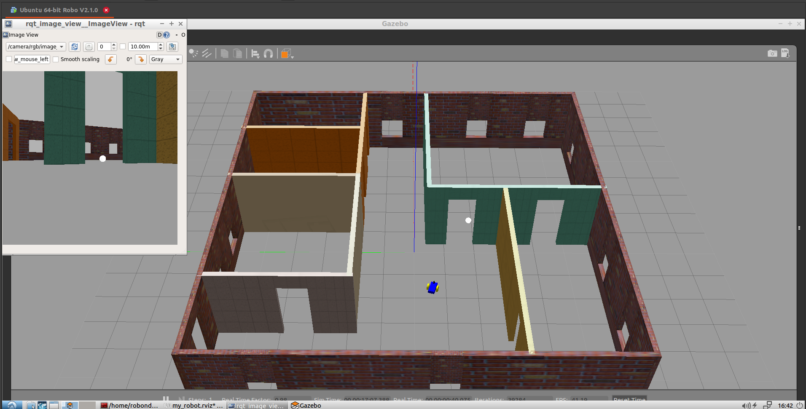

# Project 2: Go Chase It
Custom designed mobile robot to chase a white ball in the Gazebo world.
Involves two ROS nodes:
- providing ROS service to drive the robot.
- subscribed to the robot's camera for RGB image processing to define the target position. 



To start the project, run in the project's catkin workspace root directory (e.g. `~/project/catkin_ws`)
```
# 1st terminal
$ catkin_make
$ source devel/setup.bash
$ roslaunch my_robot world.launch  # start ROS Master, spawn the world and robot

# 2nd terminal
$ catkin_make
$ source devel/setup.bash
$ roslaunch ball_chaser ball_chaser.launch  # run drive_bot and process_image nodes

# 3rd terminal
$ catkin_make
$ source devel/setup.bash
$ rosrun rqt_image_view rqt_image_view  # visualize RGB images
```